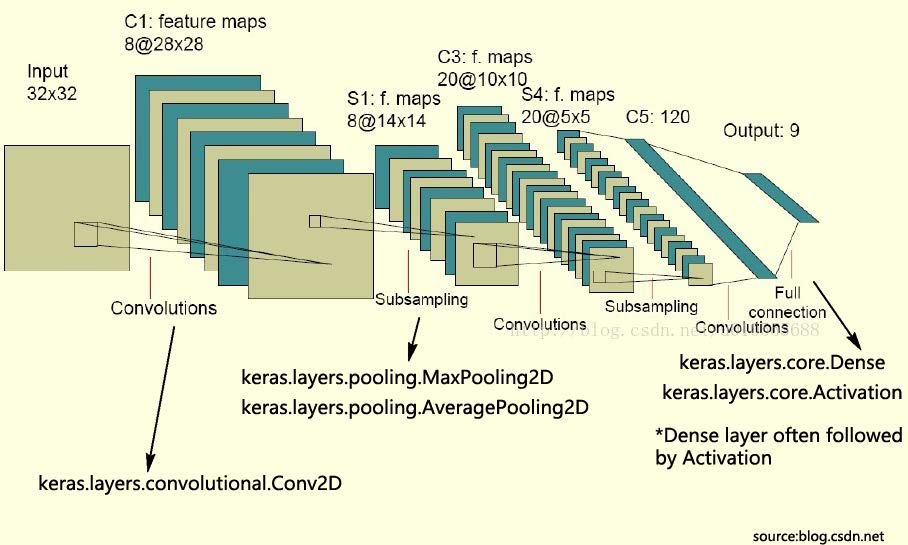
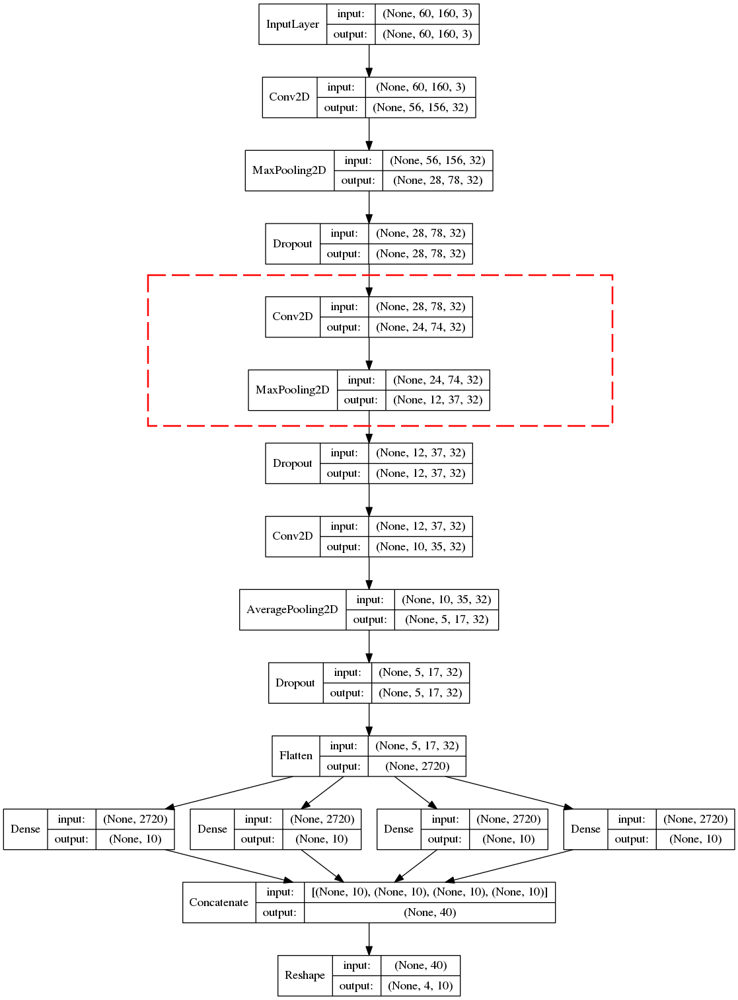

Lab2: Captcha Recognition
===

Tsinghua Deep Learning Summer School 2020

### Background: Keras

Keras is a high-level deep learning interface running on top of [TensorFlow](https://www.tensorflow.org/). 
It allows easier and faster prototyping than core TensorFlow, 
friendly to students to turn ideas into code.

Keras has direct mapping from theory to code. Take the LeNet for an example:

There are many types of activation functions, such as softmax, relu, tanh, etc. 

The picture above shows some layers provided by Keras. 
It is quite easy to understand a layer's function via its name.

Keras with a stable version of TensorFlow (`v1.5.0`) has already been installed in your environment. 

### Task #1: Make it work (50 pts)

Captcha Recognition is similar to MNIST Recognition. 
It takes a captcha as its input, and tells what numbers it contains. 
To simplify the task, the captcha contains exactly 4 twisty digits. 
Check `captcha/data` folder to see the inputs. 
The following figure is an example where the answer is `1164`.

We are using a convolution neuron network to recognize the digits.
The structure of the network is shown below.
The TA has kindly provided you with the model code in `src/models.py`
except the two layers in the red circle.
They are left blank with `# TODO` marks. 
Your task is to fill in these two layers to complete the model. 
To be more specific, you need to figure out the layer's name, kernel sizes and
other parameters to be placed there.

Take the first `Conv2D` for example, for Input, the height of image is 60, 
the width of the image is 160 and the number of channels is 3. 
They are the original size of images we feed into the network. 
The output size is 56 in height, 156 in width and 32 channels,
because we use 32 kernels/filters. 
The kernel size is $5\times 5$. 
(Why the kernel size is $5\times 5$? 
Refer to [this link](http://cs231n.github.io/convolutional-networks/#conv) for explanation.)

The TA has also generously coded the training and evaluation process in `src/main.py`.
By default, directly run `python3 main.py` in `src` directory will work 
when you have your environment properly set up and filled in the blanks correctly.
Other functions like loading/saving a model, training different number of epochs or
running evaluation on a specific model are also provided by the script.
You can run `python3 main.py --help` or look up the script for details.

Note that you are __only allowed to modify__ `models.py` in this task.
You may add debug code anywhere, but please remove them in your final submission.

#### Hint

The code can run without any modification, while the accuracy can only reach $0.85$. 
If you correctly added the layers, the accuracy typically go over $0.9$.

### Task #2: Better accuracy (50pts)

In the previous task, you finished a basic convolutional neural network to recognize captcha, but it is far not accurate enough. 
In this task, you are going to design your own network and try different parameters to make the accuracy as high as possible.

In the lower part of `models.py`, you can see `AdvancedModel` class with empty implementation and a `TODO` mark.
Your can either copy the base model above and modify it, or create a brand new model by yourself.

You may also modify the training parameters, optimizer or even training method in `main.py`. However, if you do so, please duplicate `main.py` to `main_advance.py` and modify the copy, so that the TA can better recognize what efforts you have done.

Your score in this task will be calculated using the following equation.

$$
    \text{score} = \left(\frac{\text{Your acc} - \text{baseline}(88\%)}{\text{Max acc among all students} - \text{baseline}(88\%)}\right)^{1.5} \times 50
$$

#### Hint

You can try adding some more convolution layers, tuning dropout rate and kernel sizes.
You may also learn LeNet, GoogLeNet, VGG, ResNet and other famous networks in computer vision online and implement it.

### Submission guideline

Please write a brief report using the template of `src/myefforts.txt`. 
Report your accuracy and describe what efforts you have made to finish the tasks in the text. 

You should submit all your code and the final model you use for evaluation. 
The TA will inspect your code and model, so please __do not remove__ the model files refered by your report.
You can find your models in `src/ckpt` directory by default. 
There are typically one `.index` and several `.data*` files with the same prefix as one result of training.

For submission, all you need to do is to leave your final files in `~/work/captcha` on your node in cloud.
If you are using jupyter, do not forget to copy your code back to the `.py` files and make sure that they can run.
